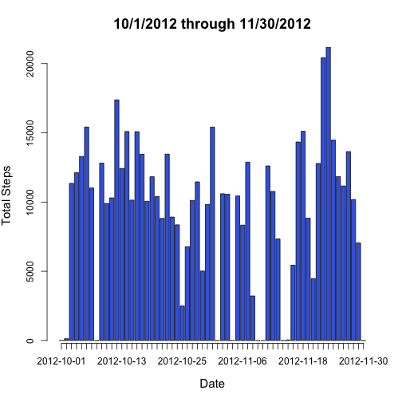
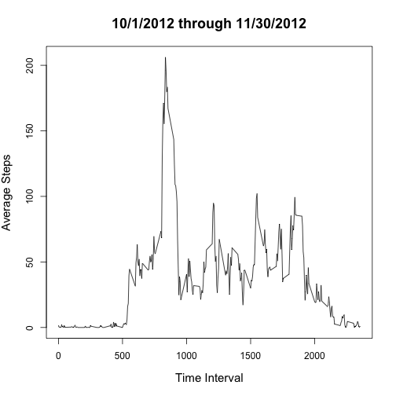
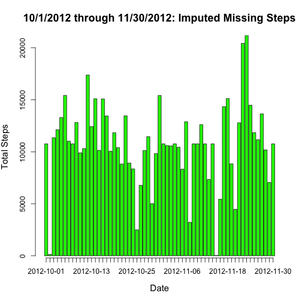
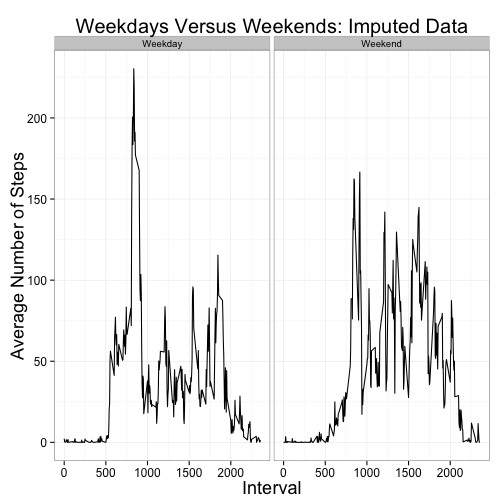

## Loading and preprocessing the data


```r
library(dplyr)
library(ggplot2)

if(!file.exists("activity.csv"))
{
    unzip("activity.zip")
}

ActivityData <- read.csv("activity.csv")
```


```r
str(ActivityData)
```

```
## 'data.frame':	17568 obs. of  3 variables:
##  $ steps   : int  NA NA NA NA NA NA NA NA NA NA ...
##  $ date    : Factor w/ 61 levels "2012-10-01","2012-10-02",..: 1 1 1 1 1 1 1 1 1 1 ...
##  $ interval: int  0 5 10 15 20 25 30 35 40 45 ...
```

```r
summary(ActivityData$steps)
```

```
##    Min. 1st Qu.  Median    Mean 3rd Qu.    Max.    NA's 
##    0.00    0.00    0.00   37.38   12.00  806.00    2304
```

```r
summary(ActivityData$interval)
```

```
##    Min. 1st Qu.  Median    Mean 3rd Qu.    Max. 
##     0.0   588.8  1178.0  1178.0  1766.0  2355.0
```

```r
dim(ActivityData)
```

```
## [1] 17568     3
```

```r
#Make date an actual date instead of a character string.
ActivityData <- mutate(ActivityData,date = as.Date(date))
```

We see that steps is the only column with NA values.  The 5 minute intervals
appear to be measured in military time.

## What is mean total number of steps taken per day?


```r
StepTotal <- select(ActivityData,-(interval)) %>%
             group_by(date) %>%
             summarize(TotalSteps=sum(steps,na.rm=TRUE))
```


```r
with(StepTotal,barplot(TotalSteps,col="royalblue",names.arg = date, 
                       xlab = "Date",ylab="Total Steps",
                       axis.lty = 1,xpd=FALSE, cex.lab=1.25)) 
title(main="10/1/2012 through 11/30/2012",cex.main=1.5)
```

 


```r
cat("The mean of total steps:",mean(StepTotal$TotalSteps),"\n")
```

```
## The mean of total steps: 9354.23
```

```r
cat("The median of total steps:",median(StepTotal$TotalSteps),"\n")
```

```
## The median of total steps: 10395
```

## What is the average daily activity pattern?


```r
AverageSteps <- select(ActivityData,-(date)) %>%
                group_by(interval) %>%
                summarize(steps=mean(steps,na.rm=TRUE))
```


```r
with(AverageSteps,plot(interval,steps,type="l",xlab="Time Interval",
                       ylab = "Average Steps",cex.lab=1.25))
title(main="10/1/2012 through 11/30/2012",cex.main=1.5)
```

 


```r
MaxSteps <- filter(AverageSteps, steps == max(steps))
cat("The interval with the maximum average steps:",as.integer(MaxSteps[1,1]),"\n")
```

```
## The interval with the maximum average steps: 835
```

## Imputing missing values


```r
table(is.na(ActivityData))
```

```
## 
## FALSE  TRUE 
## 50400  2304
```

There are 2304 NA values in the dataset.  Our analysis during preprocessing showed they are all for the steps column.

We use the mean for each interval to impute the missing values.


```r
#First, let's split the data into those rows with NA and those with valid data

splitup <- is.na(ActivityData$steps)

ActivityDataNA <- ActivityData[splitup,]
ActivityDataGood <- ActivityData[!splitup,]

dim(ActivityDataNA)
```

```
## [1] 2304    3
```

```r
dim(ActivityDataGood)
```

```
## [1] 15264     3
```

```r
#Now let's fill in the missing values for ActivityDataNA.  Let's drop the steps
#column in ActivityDataNA since they're all NA.

ActivityDataImpute <- select(ActivityDataNA,-(steps))

#Merge ActivityDataImpute with Average steps by interval.  We use select to reorder our #columns before binding the frames.

ActivityDataImpute <- merge(ActivityDataImpute,AverageSteps,by.x="interval",
                            by.y="interval",all=FALSE) %>%
                      select(steps,date,interval)

dim(ActivityDataImpute)
```

```
## [1] 2304    3
```

```r
ActivityDataNew <- rbind(ActivityDataGood,ActivityDataImpute)

dim(ActivityDataNew)
```

```
## [1] 17568     3
```


```r
StepTotalNew <- select(ActivityDataNew,-(interval)) %>%
                group_by(date) %>%
                summarize(TotalSteps=sum(steps))

with(StepTotalNew,barplot(TotalSteps,col="green",names.arg = date, 
                          xlab = "Date",ylab="Total Steps",
                          axis.lty = 1,xpd=FALSE, cex.lab=1.25)) 
title(main="10/1/2012 through 11/30/2012: Imputed Missing Steps",cex.main=1.5)
```

 

```r
cat("The new mean of total steps:",mean(StepTotalNew$TotalSteps),"\n")
```

```
## The new mean of total steps: 10766.19
```

```r
cat("The new median of total steps:",median(StepTotalNew$TotalSteps),"\n")
```

```
## The new median of total steps: 10766.19
```


With imputing the missing steps by using the mean for each time interval, the mean and median for the total number of steps have both increased and are now equal.

Let's look at StepTotal and StepTotalNew for those dates where TotalSteps increased.


```r
StepIncrease <- StepTotalNew$TotalSteps > StepTotal$TotalSteps
StepTotalRows <- StepTotal[StepIncrease,]
StepTotalRowsNew <- StepTotalNew[StepIncrease,]

knitr::kable(StepTotalRows)
```


|date       | TotalSteps|
|:----------|----------:|
|2012-10-01 |          0|
|2012-10-08 |          0|
|2012-11-01 |          0|
|2012-11-04 |          0|
|2012-11-09 |          0|
|2012-11-10 |          0|
|2012-11-14 |          0|
|2012-11-30 |          0|

```r
knitr::kable(StepTotalRowsNew)
```


|date       | TotalSteps|
|:----------|----------:|
|2012-10-01 |   10766.19|
|2012-10-08 |   10766.19|
|2012-11-01 |   10766.19|
|2012-11-04 |   10766.19|
|2012-11-09 |   10766.19|
|2012-11-10 |   10766.19|
|2012-11-14 |   10766.19|
|2012-11-30 |   10766.19|

As we can see, the imputing values using the mean for each interval, days
with previous totals of 0 were all increased to the same large value, thus the increase
in our mean and median values for total steps.

## Are there differences in activity patterns between weekdays and weekends?


```r
#Let's classify the dates by first getting the day of the week for each
#and then classifying those days of week into two buckets as a factor.

ActivityDataNew <- mutate(ActivityDataNew, DayOfWeek = weekdays(date)) %>%
                   mutate(DayClass = ifelse(DayOfWeek %in% c("Saturday","Sunday"),
                                            "Weekend","Weekday")) %>%
                   mutate(DayClass = factor(DayClass))

#Let's check our data.

table(ActivityDataNew$DayOfWeek,ActivityDataNew$DayClass)
```

```
##            
##             Weekday Weekend
##   Friday       2592       0
##   Monday       2592       0
##   Saturday        0    2304
##   Sunday          0    2304
##   Thursday     2592       0
##   Tuesday      2592       0
##   Wednesday    2592       0
```

```r
#Now let's get the average steps for our data with imputed missing values.

AverageStepsNew <- select(ActivityDataNew,-c(date,DayOfWeek)) %>%
                   group_by(interval,DayClass) %>%
                   summarize(steps=mean(steps,na.rm=TRUE))
```


```r
#Now we'll plot time series for weekdays versus weekends.

g <- ggplot(data=AverageStepsNew, aes(interval, steps)) +
     geom_line() +
     facet_grid(.~DayClass) +
     labs(x = "Interval", y = "Average Number of Steps") + 
     labs(title="Weekdays Versus Weekends: Imputed Data") + 
     theme_bw(base_family = "Arial") +
     theme(axis.title.x = element_text(size=18)) +
     theme(axis.title.y = element_text(size=18)) +
     theme(axis.text.x = element_text(size=12)) +
     theme(axis.text.y = element_text(size=12)) +
     theme(plot.title = element_text(size=20)) +
     theme(legend.text = element_text(size=12)) +
     theme(legend.title = element_text(size=14))

print(g)
```

 

Weekends appear to be more active on average during the afternoons, while weekdays show more activity than weekends during the morning hours.


